# Day05_Task03_REPORT

> **광운대학교 로봇학부**
> **작성자:** 김도훈
> **제출일:** 2026년 8월 4일
---

# 1. 개요 (Overview)

ATmega128의 Timer/Counter 1과 3은 0부터 65535까지 셀 수 있는 16비트 타이머/카운터이다.
이를 이용하여 정확한 시간 측정, 주기적인 인터럽트 발생, PWM 출력 등을 구현할 수 있다.
타이머의 동작은 제어, 카운터, 출력 비교, 입력 캡처, 인터럽트 및 플래그 레지스터를 통해 설정한다. 본 보고서에서는 Timer/Counter 1과 3의 주요 레지스터와 동작 방법을 알아본다.

# 2. TIMER/COUNTER 1, 3

아트메가 128의 타이머/카운터 1, 3은 0부터 65535 까지의 값을 셀 수 있는 16비트 타이머/카운터로 8비트 타이머/카운터보다 더 정밀한 시간 지연, 주파수 생성, PWM 제어가 가능하다.

# 3. TIMER/COUNTER 1, 3 관련 레지스터

## 3-1. 제어 레지스터 (TCCRnA, TCCRnB, TCCRnC)

타이머/카운터의 제어 레지스터는 TCCRnA, TCCRnB, TCCRnC 이렇게 세개가 있다. (여기서 n은 1과 3이다.)

TCCRnA 레지스터는 Timer/Counter Control Register A로 모드 설정, 신호 출력, 비트 설정, 클럭 신호의 prescaler(분주기) 설정이 가능하다.

```
설정할 수 있는 모드의 수는 다음과 같다.

1. Normal Mode
2. Clear Timer on Compare Match(CTC) Mode
3. Fast PWM Mode
4. Phase Correct PWM Mode
5. Phase and Frequency Correct PWM Mode
```

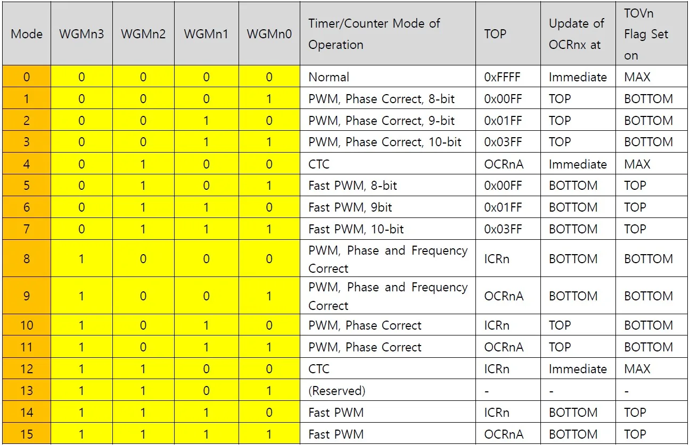

TCCRnA 레지스터는 출력 비교 핀 OCnA, OCnB, OCnC의 동작을 설정하는 COM 비트와 타이머의 동작 모드를 선택하는 WGM 비트를 포함한다. TCCRnB 레지스터는 WGM 상위 비트, 입력 캡처 설정 비트, 그리고 타이머에 공급되는 클럭과 분주비를 선택하는 CSn2~CSn0 비트를 포함한다. TCCRnC 레지스터는 강제 출력 비교 기능을 설정하는 FOCnA, FOCnB, FOCnC 비트를 포함하며, 이 기능은 비PWM 모드에서 사용된다.

타이머/카운터를 사용할 때는 위의 다섯가지 모드 중 한 모드를 선택하여 사용한다. 모드를 선택할 때는 TCCRnA과 TCCRnB의 Waveform Generation Mode인 WGMn3, WGMn2, WGMn1, WGMn0 비트를 사용해서 위의 표와 같이 모드를 설정한다. 또한 타이머1에는 파형을 출력할 수 있는 기능이 있다. 이 파형은 OC1A, OC1B, OC1C 핀을 통해서 외부로 출력된다. 각 모드에 출력되는 신호에 대한 설정은 COM00, COM01 비트를 이용해서 설정한다. 

다음은 5가지 모드를 설정하는 비트 값들이다.

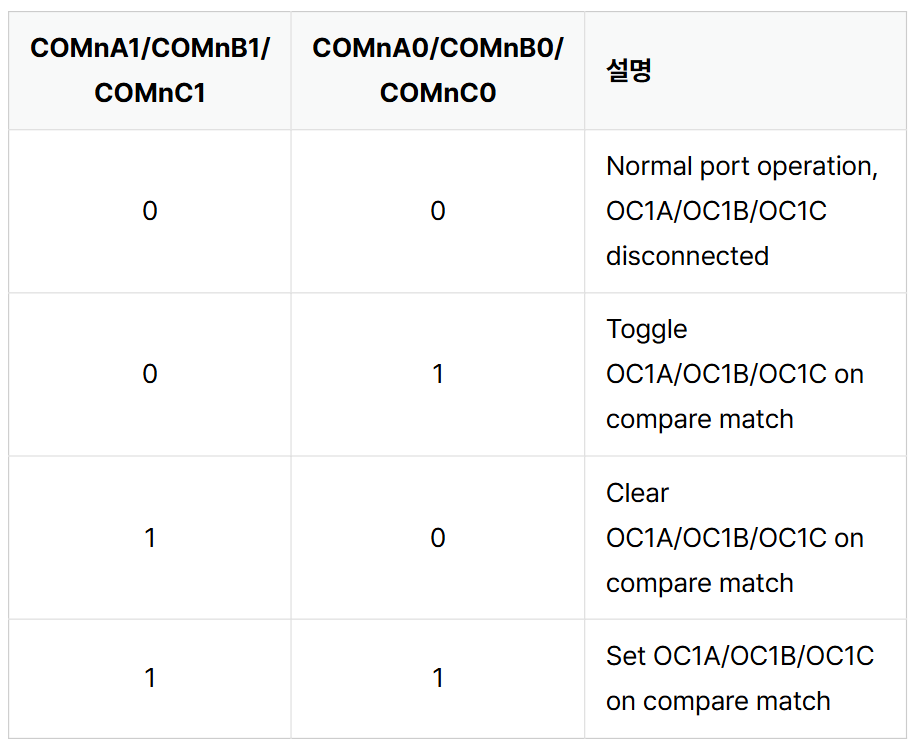 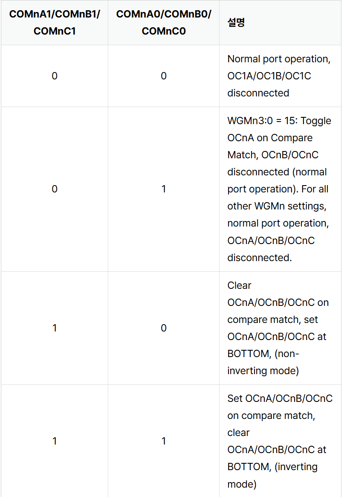  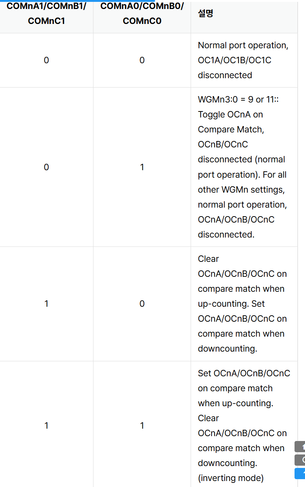

## 3-2. 카운터 레지스터(TCNTnH,TCNTnL)

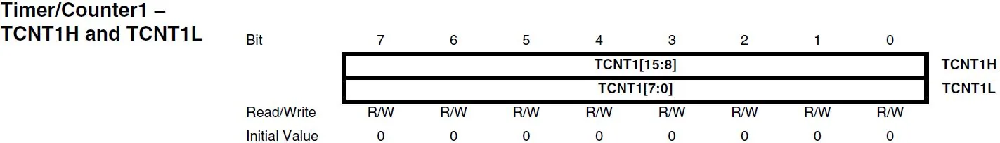

이 레지스터는 Timer/Counter n HIGH, LOW로 직접 타이머를 카운트하는 레지스터이다. 타이머 1, 3은 16비트이기 때문에 이 레지스터도 상위 8비트 레지스터, 하위 8비트 레지스터 2개로 나뉜다. 여기서 상위 레지스터는 TCNTnH이고 하위 레지스터는 
TCNTnL이다.

상위 레지스터 하위 레지스터 각각 8비트이니 총 16비트로 0x0000 ~ 0xFFFF의 범위까지 나타낼 수 있다.
MCU에서 현재 타이머가 몇 번 카운트 되었는지 카운트 클럭을 저장하는 카운터값이다. 

예를 들어 코드에서 처음 0으로 설정해놓고 타이머를 실행시키면 값은 점점 증간한다.

다음은 예시 코드이다.
```c
// 코드 작성법 1
TCNT1H = 0x12;  // 상위 바이트 먼저
TCNT1L = 0x34;  // 하위 바이트 나중

// 코드 작성법 2
TCNT1 = 0x1234 // 하나의 16비트
```
만약 작성법 1로 코드를 작성할 시 순서에 주의해야한다. 값을 쓸 때는 상위 먼저 하위 나중 값을 읽을 때는 하위 먼저 상위 먼저 하지만 작성법 2로 코드를 작성할 시 순서를 지키지 않아도 된다. 작성법 2를 사용하자


## 3-3. 출력 비교 레지스터(OCR1AH, OCR1AL, OCR1BH, OCR1BL, OCR1CH, OCR1CL

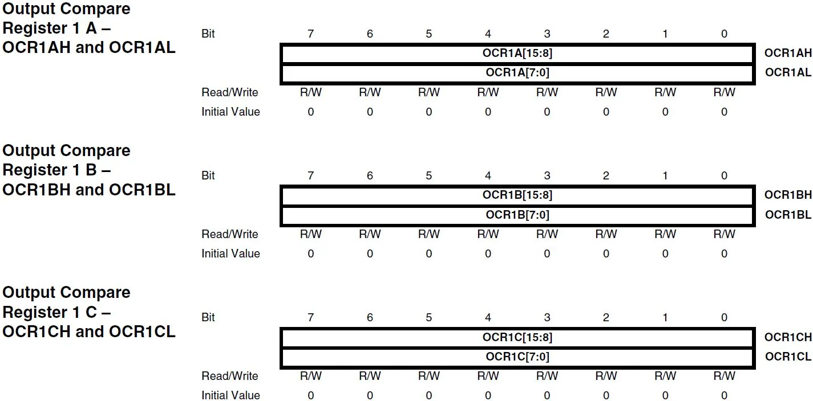

이 레지스터는 Output Compara Register로 위의에서 설명한 카운터 레지스터를 비교하기 위해서 사용되는 레지스터이다. 이 레지스터 또한 상위 8비트 레지스터, 하위 8비트 레지스터가 짝을 지어서 16비트를 만들어낸다.

이 레지스터는 비교 기준으로 설정하는 목표값이다. 위에서 설명한 카운터 레지스터의 값을 비교하는 역할을 한다.

다음은 예시 코드이다.
```c
OCR1AH = 0x12;  
OCR1AL = 0x34;

TCNT1L == OCR1AL;
TCNT1H == OCR1AH;
```

이렇게 값을 비교할 때 현재 값, 현재 타이머 클럭 값이 어느정도인지 기준을 설정할 때 사용하는 레지스터이다. 
이것 또한 상위 레지스터, 하위 레지스터로 나뉘어 있어 코드를 작성할 때 위와 같이 작성해야한다. 하지만 이것또한 한 번에 16비트로 작성 가능하기 때문에 그 작성법으로 코드를 작성하자.

## 3-4. 입력 캡쳐 레지스터(ICR1H, ICR1L)

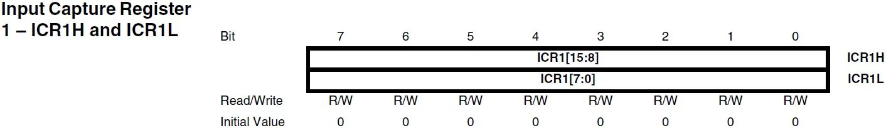

이 레지스터는 Input Capture Register로 8비트 타이머에는 없고 16비트 타이머에만 있는 레지스터이다. 입력 캡쳐는 입력 핀 ICP1에 신호가 입력되었을 때 발생하고 이때 카운터 레지스터의 값이 입력 캡쳐 레지스터로 복사된다.
입력 캡처가 발생하는 신호의 에지는 TCCRnB 레지스터의 ICESn 비트로 선택할 수 있다. ICESn이 0이면 ICRn 핀의 하강 에지에서 입력 캡처가 발생하고 1이면 상승 에지에서 입력 캡처가 발생한다. 입력 캡처가 발생하면 해당 순간의 TCNTn 값이 ICRn 레지스터에 자동으로 복사된다. 따라서 외부 신호의 주기, 펄스 폭 또는 두 신호 사이의 시간을 측정하는 데 사용할 수 있다.


## 3-5. 인터럽트 설정 레지스터(TIMSK, ETIMSK)

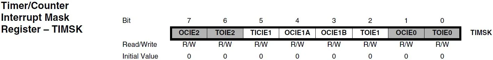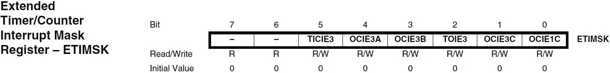

TIMSK와 ETIMSK 레지스터는 Timer/Counter Interrupt Mask Register와 Extended Timer/Counter interrupt Mask로 타이머/카운터 인터럽트를 활성화 하는 레지스터이다.

1. 5번 비트, TICIE1 : 입력 캡처 인터럽트 허용
2. 4번 비트, OCIE1A : 비교 일치 A 인터럽트 허용
3. 3번 비트, OCIE1B : 비교 일치 B 인터럽트 허용
4. 2번 비트, TOIE1 : 오버플로 인터럽트 허용

나머지 7번, 6번, 1번, 0번 비트는 타이머1, 3에 관련된 비트가 아니다.

1. 5번 비트, TICIE3 : TIMER3 입력 캡처 인터럽트 허용
2. 4번 비트, OCIE3A : TIMER3 비교 일치 A 허용
3. 3번 비트, OCIE3B : TIMER3 비교 일치 B 허용
4. 2번 비트, TOIE3 : TIMER3 오버플로 허용
5. 1번 비트, OCIE3C	: TIMER3 비교 일치 C 허용
6. 0번 비트, OCIE1C :TIMER1 비교 일치 C 허용

## 3-6. 플래그 레지스터(TIFR, ETIFR)

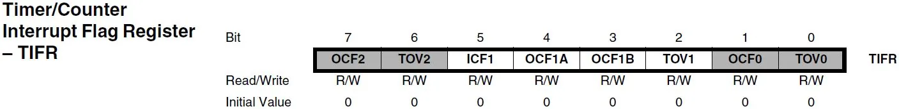
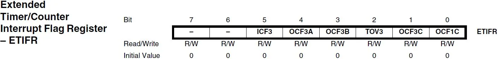

TIFR와 ETIFR 레지스터는 Timer/Counter Interrupt Flag Register와 Extended Timer/Counter interrupt Flag Register로 인터럽트가 발생한 것을 나타내는 레지스터이다. 인터럽트가 발생하면 TIFR, ETIFR의 해당 비트의 값은 1로 설정한다.

1. 5번 비트, ICF1: 타이머/카운터1 입력 캡쳐 플래그 비트
2. 4번 비트, OCF1A: 타이머/카운터1 출력 비교 A 일치 플래그 비트
3. 3번 비트, OCF1B: 타이머/카운터1 출력 비교 B 일치 플래그 비트
4. 2번 비트, TOV1: 타이머/카운터1 오버플로우 플래그 비트

한 가지를 예시로 들면 ICF1 비트가 1로 설정되면 Timer/Counter1의 입력 캡쳐 이벤트가 발생한 것을 의미한다. 입력 캡쳐 이벤트는 입력 핀 ICP1에 신호가 입력되었을 때 발생하는 인터럽트이며 이때 카운터 레지스터 TCNT1의 값이 입력 캡쳐 레지스터 ICR1으로 복사된다. 그리고 인터럽트가 실행되면 자동으로 ICF1 비트가 0으로 설정된다. 이것은 모든 비트가 같다.

1. 5번 비트, ICF3 : 타이머/카운터3 입력 캡쳐 플래그 비트
2. 4번 비트, OCF3A : 타이머 카운터 3 출력 비교 A 일치 플래그 비트
3. 3번 비트, OCF3B : 타이머 카운터 3 출력 비교 B 일치 플래그 비트
4. 2번 비트, TOV3 : 타이머 카운터 3 오버 플로우 플래그 비트
5. 1번 비트, OCF3C : 타이머 카운터 3 출력 비교 C 일치 플래그 비트
6. 0번 비트, OCF1C : 타이머 카운터 1 출력 비교 C 일치 플래그 비트

다음 예제 이해를 돕기 위한 예제 코드이다.

```c
int main()
{
  
    DDRB |= (1 << PB0);
    TCCR1A = 0x00; // 제어레지스터 
    TCCR1B = (1 << WGM12) | (1 << CS12) | (1 << CS10); 
    // WGM12을 1로 설정하여 CTC 모드 활성화, 분주비 비트 101 -> 분주비 1024
    TCCR1C = 0x00; // 사용 안함
    OCR1A = 15624; // 출력 비교 레지스터를 사용해 목표값 설정, 목표값은 카운트가 0부터 시작하므로 15625 - 1
    TCNT1 = 0; // 타이머 1 카운터 초기화 
    TIFR = (1 << OCF1A); // 1로 초기화 타이머값이 15624가 되면 0으로 됨
    TIMSK |= (1 << OCIE1A); // 출력 비교 A 인터럽트 허용

    sei(); // 전엽 인터럽트, 무조건 해야된다.

    while (1){

    }
}

ISR(TIMER1_COMPA_vect)
{
    PORTB = 0xFF; // 타이머값이 15624가 되면 실행
}
```

